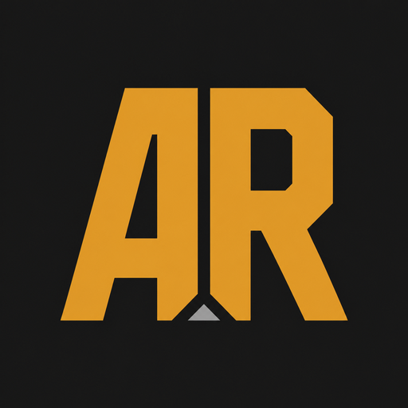

# Arma Reforger Launcher



A desktop launcher for Arma Reforger presets, Workshop downloads and server connections.
Лаунчер для пресетов Arma Reforger, загрузки модов Workshop и подключения к серверам.

[Source / Исходники](https://github.com/Redwolf29195/arma-reforger-launcher) · [Official builds / Официальные сборки](https://github.com/Redwolf29195/arma-reforger-launcher-updates/releases/latest)

## English

The launcher imports and exports `game.mods` JSON, checks installed mod versions and dependencies, searches the official Workshop, manages download queues and connects to public servers using their advertised collections. It uses a separate game profile with configurable paths.

1. Install Arma Reforger through Steam and select the game and mod directories in Settings.
2. Import a preset JSON file, paste a mod list, or choose a server collection.
3. Download missing mods and launch the game or connect to the selected server.

Workshop search and preset editing do not start the game. Downloads use the included `ALGZLauncherWorkshopBridge` and start Arma Reforger through Steam to access the game's Workshop API. The game, Steam and third-party Workshop mods are separate products and are not included in this repository.

Original project code and documentation are licensed under **GNU GPL version 3 only (`GPL-3.0-only`)**. You may use, study, modify and redistribute them under the [license](LICENSE), including its source-distribution and notice requirements. Third-party components retain their own terms; see [notices](THIRD_PARTY_NOTICES.md). Previously distributed copies retain the licenses supplied with those copies.

## Русский

Лаунчер импортирует и экспортирует JSON `game.mods`, проверяет версии и зависимости установленных модов, ищет моды в официальном Workshop, управляет очередью загрузок и подключает к публичным серверам с их наборами модов. Для игры используется отдельный профиль; пути можно изменить в настройках.

1. Установите Arma Reforger через Steam и выберите пути игры и модов в настройках.
2. Импортируйте JSON пресета, вставьте список модов или выберите коллекцию сервера.
3. Скачайте недостающие моды и запустите игру либо подключитесь к выбранному серверу.

Поиск Workshop и редактирование пресетов работают без запуска игры. Загрузка модов использует включённый `ALGZLauncherWorkshopBridge` и запускает Arma Reforger через Steam для доступа к Workshop API игры. Игра, Steam и сторонние моды не входят в этот репозиторий.

Авторский код и документация проекта распространяются под **GNU GPL только версии 3 (`GPL-3.0-only`)**. Их можно использовать, изучать, изменять и распространять с соблюдением [лицензии](LICENSE), включая требования к доступности исходников и сохранению уведомлений. Сторонние компоненты сохраняют свои условия: [THIRD_PARTY_NOTICES.md](THIRD_PARTY_NOTICES.md). Ранее распространённые копии сохраняют приложенные к ним лицензии.

## Development / Разработка

Use Node.js 22+ and pnpm 11+. / Нужны Node.js 22+ и pnpm 11+.

```sh
pnpm install --frozen-lockfile
pnpm test
pnpm start
```

Build an unpacked application or Windows Setup and Portable binaries:
Сборка распакованного приложения либо Windows Setup и Portable:

```sh
pnpm run pack
pnpm run dist:win
```

Build preparation copies readable source and the Workshop bridge to `.build/app`. These commands require no obfuscation or private signing key.
Подготовка сборки копирует читаемые исходники и мост Workshop в `.build/app`. Обфускация и закрытый ключ подписи для этих команд не нужны.

`pnpm run dist:linux` builds separate x64 AppImage and Debian packages on Linux. The Ubuntu 22.04/24.04 [CI workflow](.github/workflows/linux.yml) runs the unit suite, renderer checks and a real installed-package smoke with the sandbox enabled. `pnpm run dist:mac` remains an additional, unvalidated packaging target.

`pnpm run dist:linux` создаёт отдельные пакеты AppImage и DEB для Linux x64. [Проверки Ubuntu 22.04/24.04](.github/workflows/linux.yml) включают тесты, интерфейс и запуск установленного пакета с включённой песочницей. Цель `pnpm run dist:mac` остаётся дополнительной и не проверенной.

## Ubuntu / Linux Mint

Windows and Linux have separate downloads. For Ubuntu 22.04/24.04 and Mint 21/22, use the `.deb` package. Install Steam and Arma Reforger, select Proton in the game's Steam compatibility settings, and open the game once from Steam. Then open the launcher: it detects the installed Windows game in Steam libraries and reads its Proton profile. The launcher runs natively on Linux; Steam supplies Proton for the game.

Для Windows и Linux выпускаются отдельные файлы. В Ubuntu 22.04/24.04 и Mint 21/22 используйте пакет `.deb`. Установите Steam и Arma Reforger, выберите Proton в настройках совместимости игры в Steam и один раз откройте игру через Steam. После этого запустите лаунчер: он найдёт игру в библиотеках Steam и её профиль Proton. Сам лаунчер работает в Linux напрямую, а игру запускает Steam через Proton.

```sh
sudo apt install ./Arma-Reforger-Launcher-0.3.47-linux-x64.deb
```

The portable alternative is `Arma-Reforger-Launcher-0.3.47-linux-x64.AppImage`; make it executable before opening it. AppImage needs FUSE 2 and a working Chromium sandbox. If Ubuntu/Mint blocks its sandbox, install the `.deb` instead; no system-wide sandbox weakening is needed. Linux updates are downloaded manually from the releases page; the Windows automatic updater remains separate.

Переносной вариант — `Arma-Reforger-Launcher-0.3.47-linux-x64.AppImage`. Перед запуском разрешите выполнение файла. Для AppImage нужны FUSE 2 и доступная песочница Chromium. Если Ubuntu/Mint блокирует её, установите `.deb`. Обновления Linux скачиваются вручную со страницы релизов; автоматическое обновление Windows работает отдельно.

Select ordinary Linux paths in the launcher's Settings; it translates managed paths for Proton. Advanced filesystem arguments entered manually must use Wine paths, for example `Z:\home\user\GameProfile`. The initial supported setup uses native Steam; discovery includes Flatpak libraries, but Flatpak's filesystem permissions and SteamOS are not validated here.

В настройках лаунчера выбирайте обычные Linux-пути — необходимые пути для Proton преобразуются автоматически. Пути в дополнительных аргументах, введённых вручную, должны иметь формат Wine, например `Z:\home\user\GameProfile`. Основной вариант — обычный Steam. Поиск также видит библиотеки Flatpak, но его разрешения на папки и SteamOS здесь не проверены.

CI does not own or start Arma Reforger. Automated validation covers the launcher, packages and simulated Steam/Proton lifecycle, including crash/exit handling. Actual gameplay, Workshop network downloads and multiplayer compatibility still require a game session on Linux. See [Valve's Proton documentation](https://github.com/ValveSoftware/Proton) for the compatibility layer.

В тестовой среде Arma Reforger не запускается. Автоматические проверки охватывают лаунчер, установку и имитацию работы Steam/Proton, включая закрытие и сбой игры. Игровой процесс, сетевую загрузку Workshop и подключение к серверам необходимо дополнительно проверить с самой игрой на Linux.

Official update releases authenticate downloaded artifacts. Maintainer instructions and source-publication requirements: [RELEASE-PROCESS.md](RELEASE-PROCESS.md).
Официальные обновления проверяют подлинность загружаемых файлов. Порядок выпуска и публикации исходников: [RELEASE-PROCESS.md](RELEASE-PROCESS.md).

## Credits / Авторы

Copyright © 2026 **ALGZ / ExtaZzZ and contributors / и участники проекта**.

Developers / Разработчики:

- **ExtaZzZ** — Discord: **legoshi223**.
- **Palma** — Discord: **4elakoc**.
- **Plocheck** — Discord: **.plochek**.

Launcher artwork was provided by the project owner. Графика лаунчера предоставлена владельцем проекта.

This is an independent community project, not affiliated with, endorsed by or authorized by Bohemia Interactive a.s. ARMA and Arma Reforger are Bohemia Interactive trademarks.
Это независимый проект сообщества, не связанный с Bohemia Interactive a.s. и не одобренный ею. ARMA и Arma Reforger — товарные знаки Bohemia Interactive.
